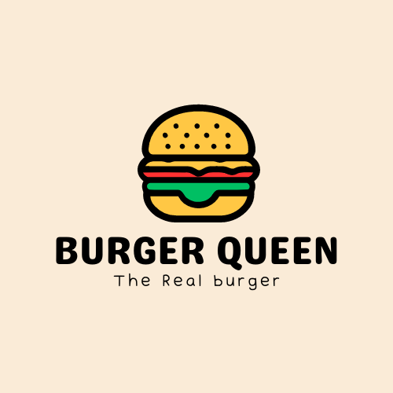

# Burger Queen (API Client)

## Índice

* [1. Preámbulo](#1-preámbulo)
* [2. Resumen del proyecto](#2-resumen-del-proyecto)
* [3. Historias de usuario](#3-historias-de-usuario)
* [4. Consideraciones de la Api](#4-consideraciones-de-la-Api)
* [5. Prototipo de alta](#5-prototipo-de-alta)
* [6. Interfaces](#6-interfaces)
* [7. Pruebas Unitarias](#7-pruebas-unitarias)
* [8. Despliegue](#8-despliegue)
* [9. Modo de uso](#9-modo-de-uso)
* [10. Referencias](#10-referencias)

***

## 1. Preámbulo

[React](https://react.dev/) y [Angular](https://angular.io/)
son algunos de los _frameworks_ y _librerías_ de JavaScript más utilizados por
lxs desarrolladorxs alrededor del mundo, y hay una razón para eso.
En el contexto del navegador, [_mantener la interfaz sincronizada con el estado
es difícil_].
Al elegir un _framework_ o _librería_ para nuestra interfaz, nos apoyamos en una
serie de convenciones e implementaciones _probadas_ y _documentadas_ para
resolver un problema común a toda interfaz web. Esto nos permite concentrarnos
mejor (dedicar más tiempo) en las características _específicas_ de
nuestra aplicación.

Como desarrolladora Front-end, estos kits de desarrollo pueden resultar
de gran ayuda para implementar rápidamente características de los proyectos en
los que trabajes.

## 2. Resumen del proyecto

En este proyecto se construyo un sistema a través del cual puedan tomar pedidos usando una _tablet_, y enviarlos
a la cocina para que se preparen ordenada y eficientemente.

Este proyecto tiene dos áreas: interfaz (cliente) y API (servidor). Nuestra
clienta nos ha solicitado desarrollar la interfaz que se integre con una API.

La interfaz debe mostrar los dos menús (desayuno y resto del día), cada uno con todos sus productos. La usuaria debe poder ir eligiendo qué productos agregar y la interfaz debe ir mostrando el resumen del pedido con el costo total.

El framework utilizado fue React, para el desarrollo de la interfaz, mediante peticiones HTTP a la api mocks. 

## 3. Historias de usuario

Para la planificación del proyecto, se ocupo Trello, donde se fue derarrollando de acuerdo a las historias de usuario planteadas y que con las siguientes. 

#### [Historia de usuario 1] Mesero/a debe poder ingresar al sistema, si el admin ya le ha asignado credenciales

Yo como meserx quiero poder ingresar al sistema de pedidos.

##### Criterios de aceptación

Lo que debe ocurrir para que se satisfagan las necesidades del usuario.

* Acceder a una pantalla de login.
* Ingresar email y contraseña.
* Recibir mensajes de error comprensibles, dependiendo de cuál es el error
  con la información ingresada.
* Ingresar al sistema de pedidos si las crendenciales son correctas.

***

#### [Historia de usuario 2] Mesero/a debe poder tomar pedido de cliente/a

Yo como meserx quiero tomar el pedido de unx clientx para no depender de mi mala
memoria, para saber cuánto cobrar, y enviarlo a la cocina para evitar errores y
que se puedan ir preparando en orden.

##### Criterios de aceptación

Lo que debe ocurrir para que se satisfagan las necesidades del usuario

* Anotar nombre de clientx.
* Agregar productos al pedido.
* Eliminar productos.
* Ver resumen y el total de la compra.
* Enviar pedido a cocina (guardar en alguna base de datos).
* Se ve y funciona bien en una _tablet_

***

#### [Historia de usuario 3] Jefe de cocina debe ver los pedidos

Yo como jefx de cocina quiero ver los pedidos de lxs clientxs en orden y
marcar cuáles están listos para saber qué se debe cocinar y avisar a lxs meserxs
que un pedido está listo para servirlo a un clientx.

##### Criterios de aceptación

* Ver los pedidos ordenados según se van haciendo.
* Marcar los pedidos que se han preparado y están listos para servirse.
* Ver el tiempo que tomó prepara el pedido desde que llegó hasta que se
  marcó como completado.

***

#### [Historia de usuario 4] Meserx debe ver pedidos listos para servir

Yo como meserx quiero ver los pedidos que están preparados para entregarlos
rápidamente a lxs clientxs que las hicieron.

##### Criterios de aceptación

* Ver listado de pedido listos para servir.
* Marcar pedidos que han sido entregados.

***

#### [Historia de usuario 5] Administrador(a) de tienda debe administrar a sus trabajadorxs

Yo como administrador(a) de tienda quiero gestionar a los usuarios de
la plataforma para mantener actualizado la informacion de mis trabajadorxs.

##### Criterios de aceptación

* Ver listado de trabajadorxs.
* Agregar trabajadorxs.
* Eliminar trabajadoxs.
* Actualizar datos de trabajadorxs.

***

#### [Historia de usuario 6] Administrador(a) de tienda debe administrar a sus productos

Yo como administrador(a) de tienda quiero gestionar los productos
para mantener actualizado el menú.

##### Criterios de aceptación

* Ver listado de productos.
* Agregar productos.
* Eliminar productos.
* Actualizar datos de productos.

***

## 4. Consideraciones de la Api

En el proyecto se utilizo la api mock, la cual fue desplegada...... y esta disponible en......

Para probar inicilamente las rutas se relizaron algunas peticiones de prueba que se ejecutaron con REST Client, una extensión de Visual Studio Code.

Se fueron consumiendo las rutas de acuerdo a la documentación entregada. [Documentación](https://app.swaggerhub.com/apis/ssinuco/BurgerQueenAPI/2.0.0#/users/getUserById)

* Ejemplo cuando se realiza Petición Post a la api mock, en login.

* Ejemplo lista de usuarios y productos en la api.

## 5. Prototipo de alta

Para el desarrollo de la interfaz inicialmente se realizaron prototipos de alta fidelidad, para vista responsive en tablet. Se diseño el logo y cada una de las páginas correspondientes a las vistas Waiter, Chef y Admin.

#### Logo Burger Queen

#### Prototipo Home y Login

#### Prototipo Vista Waiter

#### Prototipo Vista Chef

#### Prototipo Vista Admin

## 6. Interfaces

#### Home

#### Login

#### Waiter

* Vista para tomar pedidos

* Vista pedidos para entregar

#### Chef

* Vista pedidos pendientes

* Vista pedidos listos

#### Admin

* Vista pedidos listos

* Vista Agregar trabajador

## 7. Pruebas Unitarias

Se utilizo Jest para testear los componentes de React, testiando el comportamiento
de la aplicación. Se realizaron 16 test para los componentes Login, Waiter, Chef y Workers List, con un coverage sobre el 80%. 

## 8. Despliegue

Para el despliegue de la aplicación y Api Mock, se ocupo [Vercel](https://vercel.com/) que es una plataforma de _despliegue_ que nos permite desplegar nuestra aplicación web estática (HTML, CSS y
JavaScript) y también nos permite desplegar aplicaciones web que se ejecutan en el servidor (Node.js).

* Aplicación ya desplegada.
[Burger-Queen Api Client](https://dev-004-burger-queen-api-client-weld.vercel.app/) 

* Api Mock ya desplegada.
[Api Mock](https://json-server-beta-mauve.vercel.app/) 

## 9. Modo de Uso

Para la utilización de la aplicación debe ser mediante Node.js.

Primero se clona el proyecto: 
`$ git clone https://github.com/GloVillagran/DEV004-burger-queen-api-client.git`

Instalación de dependencias:
`$ npm install`

Correr la aplicación: 
`$ npm run dev`

Testeo de la aplicación:
`$ npm test`

## 10. Referencias

### Frameworks 

* [React](https://react.dev/)

### Herramientas

* [npm-scripts](https://docs.npmjs.com/misc/scripts)
* [Babel](https://babeljs.io/)
* [json-server](https://www.npmjs.com/package/json-server)

### Testing

* [Testing-library](https://testing-library.com/docs/)
* [Testing-navigation-in-react](https://dev.to/grusingh/testing-navigation-in-react-310m)
* [Testing-React-App](https://jestjs.io/docs/tutorial-react)
